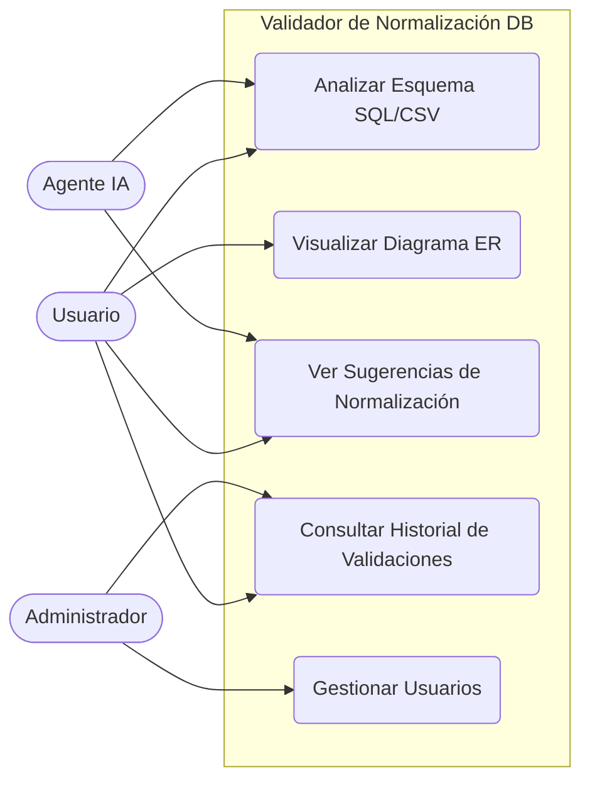
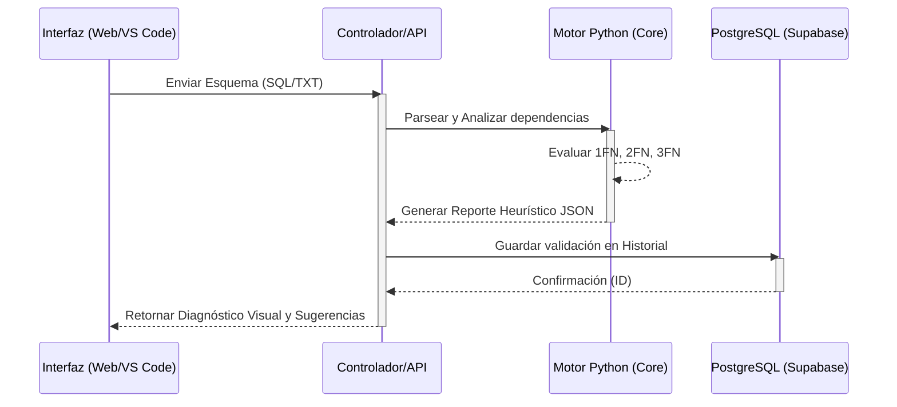
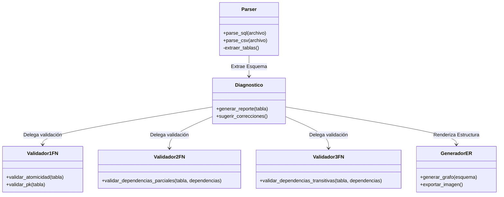
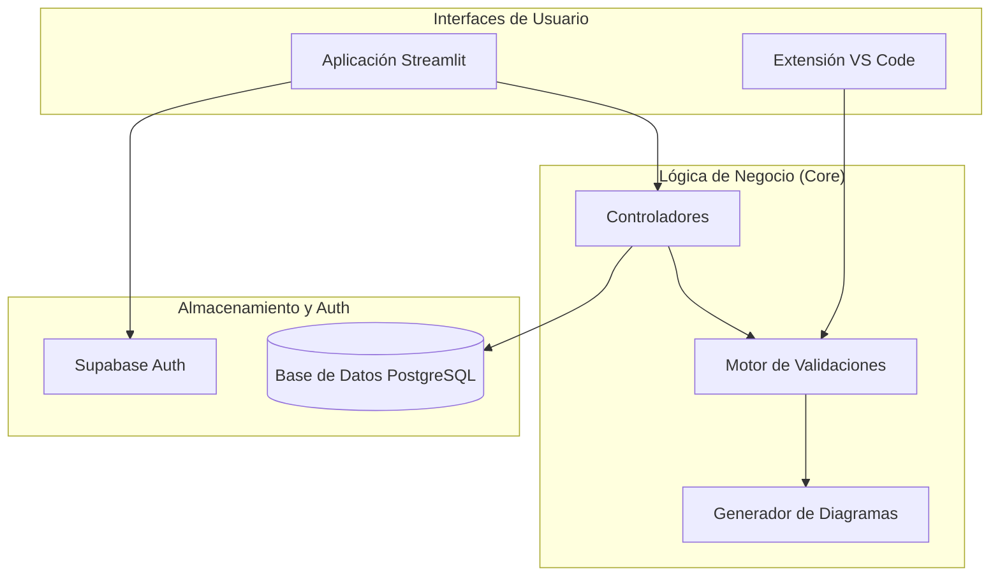
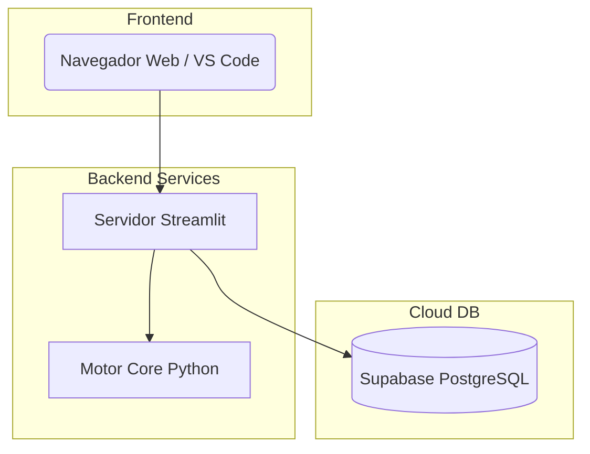

# 🗃️ Validador de Normalización de Bases de Datos Relacionales


Aplicación web en Python con Streamlit y **Extensión de VS Code** para analizar esquemas de bases de datos relacionales, detectar violaciones a las formas normales y sugerir mejoras estructurales de forma automática. Soporta entrada de esquemas mediante archivos (`.txt`, `.csv`, `.xls`, `.sql`) o pegado directo de código SQL. Incluye también una **Agent Skill** para integración con asistentes de Inteligencia Artificial.

LINK del sistema: app-dataquest-web.azurewebsites.net


VIDEO DEMO: https://drive.google.com/drive/folders/1qWd4konZpkmquT694xuTZTp28ZyWs0LN?usp=drive_link

SKILL PUBLICADA: https://github.com/FabrizioPerezPeralta/Skill_DataQuest_Validador_Nomalizacion.git 

EXTENSION VS CODE: DataQuest

---

## 📋 Tabla de Contenidos

- [Descripción](#-descripción)
- [Stack Tecnológico](#-stack-tecnológico)
- [Arquitectura MVC](#-arquitectura-mvc)
- [Características](#-características)
- [Extensión de VS Code y Agent Skill](#-extensión-de-vs-code-y-agent-skill) *(¡NUEVO!)*
- [Autenticación y Comunidad](#-autenticación-y-comunidad)
- [Entrada de Esquemas](#-entrada-de-esquemas)
- [Motor de Análisis y Normalización](#-motor-de-análisis-y-normalización)
- [Visualización de Diagramas](#-visualización-de-diagramas)
- [Historial de Validaciones](#-historial-de-validaciones)
- [Requisitos](#-requisitos)
- [Uso](#-uso)
- [Estructura del Proyecto](#-estructura-del-proyecto)
- [Formas Normales Soportadas](#-formas-normales-soportadas)
- [Licencia](#-licencia)

---

## 📖 Descripción

El **Validador de Normalización de Bases de Datos Relacionales** permite a estudiantes, desarrolladores y administradores de bases de datos verificar si un esquema cumple con las reglas de normalización (1FN, 2FN, 3FN), detectar dependencias funcionales problemáticas y obtener sugerencias concretas para corregir la estructura de sus tablas. Ahora integrado directamente en tu editor mediante una Extensión de Visual Studio Code y preparado para agentes IA.

---

## 🛠️ Stack Tecnológico

| Capa | Tecnología | Rol |
|---|---|---|
| **Lenguaje Core** |  Python 3.10+ | Lógica principal del validador y CLI |
| **Interfáz Web** |  Streamlit | Vista interactiva (formularios, diagramas) |
| **Extensión IDE** |  TypeScript / VS Code API | Inyección de reportes en el editor |
| **Base de datos** |  PostgreSQL 16 | Almacenamiento de esquemas y resultados |
| **BaaS** |  Supabase | Hosting DB, Autenticación y Realtime |
| **Visualización** |  Graphviz / NetworkX | Generación de diagramas ER |

---

## 🏗️ Arquitectura MVC

El proyecto sigue el patrón **Modelo-Vista-Controlador (MVC)** extendido para soportar CLI e IDEs:

```
┌──────────────────────────────────────────────────────────────────────┐
│                              VISTAS                                  │
│   Streamlit Web (app.py)   |   VS Code Extension (extension.ts)      │
└──────────────────────────┬───────────────────────────────────────────┘
                           │  llama a
                           ▼
┌──────────────────────────────────────────────────────────────────────┐
│                    CONTROLADORES / CLI                               │
│      controllers/ (Web)    |    core/cli.py (IDE / Agentes)          │
└──────────┬───────────────────────────────┬───────────────────────────┘
           │ usa                           │ usa
           ▼                               ▼
┌──────────────────────┐   ┌──────────────────────────────────────────┐
│   MODELO (lógica)    │   │            MODELO (datos)                │
│        core/         │   │                 db/                      │
│  Parser · DF         │   │  Supabase Auth   → registro / login      │
│  Validadores 1/2/3FN │   │  PostgreSQL      → historiales           │
└──────────────────────┘   └──────────────────────────────────────────┘
```

---

## ✨ Características

| Funcionalidad | Descripción | Estado |
|---|---|---|
| 💻 **Extensión VS Code** | Valida esquemas directamente en el editor e inyecta comentarios con los resultados | ✅ Completado |
| 🤖 **Agent Skill** | `SKILL.md` integrado para que la IA interprete y valide automáticamente esquemas | ✅ Completado |
| 🛠️ **CLI Independiente** | Utilidad en línea de comandos (`core/cli.py`) que devuelve JSON estructurado | ✅ Completado |
| 👤 Registro de usuarios | Creación de cuenta con correo y contraseña vía Supabase | 📋 Pendiente |
| 🌐 Panel de comunidad | Muestra usuarios conectados en tiempo real con Supabase Realtime | 📋 Pendiente |
| ✅ Validación de 1/2/3FN | Detecta violaciones y sugerencias (Algoritmos Clásicos) | ✅ Completado |

---

## 🚀 Extensión de VS Code y Agent Skill *(¡NUEVO!)*

### Extensión para Visual Studio Code
El proyecto ahora cuenta con una extensión oficial de VS Code que te permite analizar la normalización sin salir de tu editor. 

- **Soporte Multiformato:** Funciona en archivos `.sql`, `.txt`, `.csv` o cualquier archivo que contenga comandos `CREATE TABLE`.
- **Inyección Automática:** Al ejecutar el comando **`Validador DB: Analizar e Inyectar Reporte`** desde la paleta (`Ctrl+Shift+P`), la extensión lee tu archivo, lo envía al motor Python y escribe los resultados y correcciones sugeridas al final del documento en un bloque de comentarios SQL (`/* ... */`).

### Agent Skill para IA
En `.agents/skills/validador_normalizacion/SKILL.md` hemos documentado toda la lógica heurística del motor (cómo detecta dependencias parciales y transitivas). Esto permite que **cualquier Agente de IA** (como Claude, GPT o agentes locales) pueda ejecutar el validador, entender profundamente las fallas de diseño de la base de datos y ofrecer explicaciones pedagógicas directamente en el chat.

---

## 🔐 Autenticación y Comunidad

*(En desarrollo para la versión Web)*
El sistema permite crear cuentas y mantener sesiones vivas vía Supabase Auth. La página de comunidad mostrará los usuarios conectados al sistema en tiempo real usando Supabase Realtime.

---

## 📂 Entrada de Esquemas

El sistema acepta esquemas mediante:
- **Carga de archivos:** `.sql`, `.txt`, `.csv`, `.xls`
- **Pegado directo:** En la web de Streamlit.
- **Documento activo (IDE):** Desde VS Code leyendo la selección o el archivo completo.

---

## 🔬 Motor de Análisis y Normalización

> **Importante:** Todo el análisis se realiza mediante **algoritmos clásicos de normalización** y heurísticas programadas en Python (`core/`).

### Diagnóstico e Inferencia Heurística
Si no se proveen dependencias funcionales, el motor las infiere automáticamente:
1. **Dependencias Parciales:** Detectadas en claves compuestas.
2. **Dependencias Transitivas:** Inferidas por prefijos/sufijos `_id` o entidades semánticas comunes.
3. **Tablas Sábana:** Sugerencias drásticas de partición para tablas con más de 6 atributos no clave.

---

## 📊 Visualización de Diagramas

La aplicación web generará:
- **Vista ER Clásica:** Con Graphviz.
- **Schema de Tablas:** Renderizado con Matplotlib mostrando PKs (🔑) y FKs (🔗).

---

## 📜 Historial de Validaciones

El sistema guardará automáticamente cada análisis realizado en el sistema web en PostgreSQL (Supabase) con *Row Level Security* para garantizar la privacidad de los esquemas analizados por cada usuario.

---

## ⚙️ Requisitos

- Python **3.10** o superior
- Node.js (para la extensión de VS Code)
- Cuenta en [Supabase](https://supabase.com) (gratuita)

### Variables de entorno
Crea un archivo `.env` en la raíz:
```env
SUPABASE_URL=https://tu-proyecto.supabase.co
SUPABASE_KEY=tu-anon-key
DATABASE_URL=postgresql://...
```

---

## 🖥️ Uso

### Uso de la Aplicación Web
```bash
streamlit run app.py
```

### Uso del CLI (Para Agentes y Scripts)
```bash
python core/cli.py ruta_a_tu_esquema.sql
```
*Devuelve un JSON estructurado con el nivel actual y las violaciones de cada forma normal.*

### Uso de la Extensión de VS Code
1. Entra a `vscode-extension/` y ejecuta `npm install`.
2. Presiona `F5` en VS Code para iniciar el entorno de prueba.
3. Abre un archivo SQL, presiona `Ctrl+Shift+P` y ejecuta `Validador DB: Analizar e Inyectar Reporte`.

---

## 🏗️ Arquitectura y Diagramas

A continuación, se presentan los diagramas de arquitectura del Validador de Normalización.

### 1. Diagrama de Casos de Uso



### 2. Diagrama de Secuencia



### 3. Diagrama de Clases (Lógica Central)



### 4. Diagrama de Componentes



### 5. Diagrama de Despliegue e Infraestructura



---

## 📁 Estructura del Proyecto

```
validador-normalizacion/
│
├── app.py                   # Vista principal web Streamlit
├── requirements.txt         
├── README.md
│
├── .agents/                 # [NUEVO] Agent Skills
│   └── skills/validador_normalizacion/SKILL.md
│
├── vscode-extension/        # [NUEVO] Extensión de Visual Studio Code
│   ├── package.json
│   └── src/extension.ts     # Lógica TypeScript que inyecta reportes
│
├── controllers/             # Controladores (Web)
├── core/                    # Modelo Lógico (Algoritmos puros)
│   ├── cli.py               # [NUEVO] Punto de entrada JSON
│   ├── parser.py            
│   ├── dependencias.py      
│   ├── diagnostico.py       
│   ├── validador_1fn.py     
│   ├── validador_2fn.py     
│   └── validador_3fn.py     
│
├── db/                      # Capa de datos (Supabase)
├── visualizacion/           # Vistas de diagramas (Graphviz)
├── tests/                   # Pruebas BDD, Unitarias e Integración
└── ejemplos/                # Casos de prueba SQL/CSV
```

---

## 📐 Formas Normales Soportadas

- **1FN:** Todos los atributos atómicos, filas únicas.
- **2FN:** Sin dependencias parciales respecto a claves compuestas.
- **3FN:** Sin dependencias transitivas entre atributos no clave.

---

## 📄 Licencia

Este proyecto está bajo la licencia **MIT**. Consulta el archivo [LICENSE](LICENSE) para más detalles.

---

<p align="center">Desarrollado con ❤️ en Python + TypeScript + Streamlit</p>
